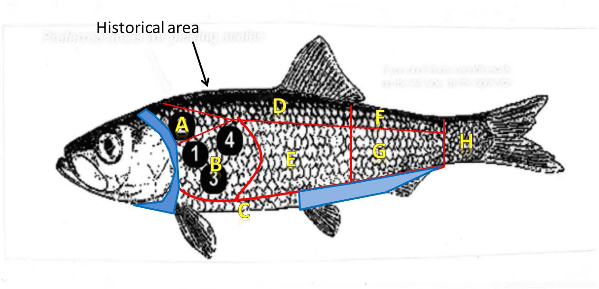

```{r set-up, echo=FALSE, warning=F}

library(knitr)

```
###Background
Sherri Dressel and I are working on an NPRB herring maturity study. The study examines a new way of estimating maturity empirically for Pacific herring (*Clupea pallasii*) using scales, following methods applied successfully to Norwegian spring-spawning Atlantic herring (*Clupea harengus*) (Engelhard et al., 2003; Barros and Holst 1995). One of our objectives is to assess whether mature Sitka Sound herring grow less than immature herring during the summer before spawning. Maturity assessment will be based on histology. Scale measurements of immature and mature individuals will be compared. The alternative hypothesis is that within an age, mature herring will have smaller mean outer-ring scale growth than immature herring. 

Pacific herring were collected from the winter bait test fishery in Sitka Sound during field sampling in the fall of 2017. Due to the difficulty of collecting herring with quality scales in the field, we have decided to do an additional pilot study to show that our results will still be valid despite needing to take scales from different regions on a fish.

Fish body growth is related to scale growth (Creaser 1926, Whitney and Carlander 1956, Hile 1970, Francis 1990) but 1) annuli growth:fish growth varies by region on fish and 2) proportional annual growth:body growth varies by region on fish but is less variable than absolute growth (Whitney and Carlander 1956, El Zarka 1959, Joeris 1957, Hirschhorn and Small 1987).  Therefore, we need an additional study to disprove statement #2 for Sitka Sound Pacific herring or only use scales from the preferred area (region B). Before the herring are jigged for this additional study, we need to determine an adequate sample size. 

Questions for our additional  study: 

1.	Do proportions hold across regions? Is there variability between regions?
2.	Is the variability within each region less compared to the variability across the regions?

###Methods
To answer these questons, we will be jigging for herring this spring in Sitka Sound. Fish will be sent to the MTA lab in Juneau so scales can be plucked, mounted, digitized, measured, and aged. Each fish will be considered its own population with eight groups (or regions) (Figure 1). 
```{r figure, echo=FALSE, out.width = '400px', out.height = '400px', dpi=600}

```

**Figure 1**: Eight regions on the herring.

We will sample three scales from each of the eight regions of the fish. Then, an ANOVA will be run on each fish and a mean proportion (distance from the scale focus to the first annulus divided by the total scale length) for each region, by fish, will be computed. The number of region comparisons (e.g. A versus B; C versus H) that have an adjusted p-value of <=0.05 (p_adj_0.05) will be computed for each fish and each regional comparison (e.g. fish one, region A versus B; fish two, region A versus B). For the example dataset, there are 12 fish (see data/madeup_data) (Table 1).

**Table 1**: Full output of adjusted p-value for each ANOVA for region comparisons where the factor region was significant (fish 1 and fish 7 only).
```{r full_output, echo=FALSE, eval=TRUE, warning=F, message=F, error=F,as.is=T}
library(readr)
library(kableExtra)
data <- read_csv("output/Tukey.csv")
drop <- c("X1", "parameter")
data <- data[,!(names(data) %in% drop)] 
data<-data[,c(6,7,1:5)]
kable(data, format = "html") %>%
  kable_styling(full_width = F) %>%
  scroll_box(width = "800px", height = "400px")
```

Next, the proportion of the adjusted p-values that are <= 0.05 will be computed across all fish for each region pair (e.g. A versus B) (Table 2).

**Table 2**: Frequency of p.adj<=0.05 for paired regions of all fish combined (n=12 fish). 
```{r freq_table, echo=FALSE, eval=TRUE, warning=F, message=F, error=F,as.is=T}
library(readr)
library(kableExtra)
data <- read_csv("output/frequency_no_zeros.csv")
kable(data, format = "html") %>%
  kable_styling(full_width = F)
```

For analysis of the data, do a random effects model with fish ID as the random effect for the repeated samples; region would be main effect
-Combine all fish into one sample for analysis
-use the package 'pwr' to determine sample size or determine effect size for Cohen example from spreadsheet
-question is in determining effect size
--could look at variability within mature outer ring samples from a dataset and then do a simulation between a mature and immature population 
(http://www.kean.edu/~fosborne/bstat/05d2pops.html)

####References 
Barros, P. and Holst, J.C., 1995. Identification of geographic origin of Norwegian spring-spawning herring (*Clupea harengus L.*) based on measurements of scale annuli. ICES Journal of Marine Science: Journal du Conseil, 52: 863-872.

Creaser, C.W., 1926. The structure and growth of the scales of fishes in relation to the interpretation of their life-History, with special reference to the sunfish *Eupomotis gibbosus*. University of Michigan, Museum of Zoology, Miscellaneous Publication No. 17.

El-Zarka, S., 1959. Fluctuations in the population of yellow
perch, *Perca flavescens* (Mitchill), in Saginaw Bay; Lake Huron. U.S. Fish and Wildlife Service, Fishery Bulletin 151, vol. 59, pp. 365-415.

Engelhard, G.H., Dieckmann, U., and Godø, O.R. 2003. Age at maturation predicted from routine scale measurements in Norwegian spring-spawning herring (*Clupea harengus*) using discriminant and neural network analyses. ICES Journal of Marine Science: Journal du Conseil, 60: 304-313. 

Francis, R.I.C.C.,  1990.  Back-calculation of fish length: a critical review.  J. Fish. Biol. 36:883-902.

Hile, R., 1970. Body-scale relation and calculation of growth in fishes. Transactions of the American Fisheries Society, 99(3): 468-474, DOI: 10.1577/1548-8659(1970)99<468:BRACOG>2.0.CO;2 

Hirschhorn, G., and Small, G. J., 1987. Variability in growth parameter estimates from
scales of Pacific cod based on scale and area measurements. In Age and Growth of
fish (R. C. Summerfelt & G. E. Hall, eds), pp. 147—157. Ames, IA: Iowa State
University Press.

Joeris, L.S., 1957. Structure and Growth of Scales of Yellow
Perch of Green Bay, Transactions of the American Fisheries Society, 86:1, 169-194, DOI:
10.1577/1548-8659(1956)86[169:SAGOSO]2.0.CO;2

Whitney, R., and Carlander, K., 1956. Interpretation of Body-Scale Regression for Computing Body Length of Fish. The Journal of Wildlife Management, 20(1): 21-27. doi:10.2307/3797243